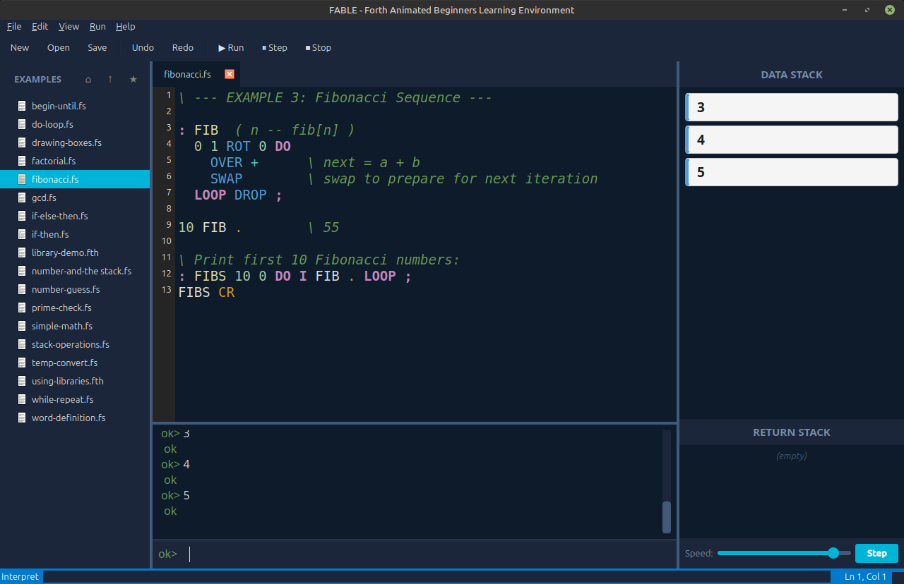

<div align="center">


# FABLE
## Forth Animated Beginners Learning Environment

*Every stack tells a story*

[](https://www.python.org/downloads/)
[](https://pypi.org/project/PyQt6/)
[](LICENSE)

**An educational IDE for learning the Forth programming language through animated stack visualization**

[Features](#-features) • [Installation](#-installation) • [Quick Start](#-quick-start) • [Documentation](#-documentation) • [Examples](#-examples) • [Contributing](#-contributing)

</div>

---

## 📸 Screenshot



---

## 🎯 What is FABLE?

FABLE is a modern, visual IDE designed specifically for learning Forth—a stack-based, concatenative programming language. Unlike traditional Forth environments, FABLE makes the abstract concept of stack manipulation **concrete and observable** through real-time animated visualizations.

Whether you're a complete beginner to programming or an experienced developer curious about stack-based languages, FABLE provides an intuitive, engaging environment to explore Forth's unique paradigm.

### Why FABLE?

- **🎬 Animated Stack Visualization** - Watch values flow through the data and return stacks with smooth, color-coded animations
- **📚 Educational Focus** - Built from the ground up for learning, with comprehensive examples and tutorials
- **🎨 Modern Interface** - Clean, professional 4-panel IDE with syntax highlighting and dark/light themes
- **🔧 Interactive REPL** - Immediate feedback loop for experimenting with Forth words
- **📦 Library System** - Save and reuse your word definitions across sessions
- **🎓 Step-Through Debugging** - Execute code word-by-word to understand exactly what's happening

---

## ✨ Features

### Core Features

- **Animated Stack Widget** - Real-time visualization of data and return stacks with smooth animations for push, pop, swap, and other operations
- **Custom Forth Interpreter** - Educational interpreter with 60+ primitive words and execution hooks for animation synchronization
- **4-Panel IDE Layout**
  - **File Browser** (left) - Navigate projects with bookmarks and persistence
  - **Code Editor** (center-top) - Syntax highlighting, line numbers, auto-indentation
  - **Interactive REPL** (center-bottom) - Test code immediately with command history
  - **Stack Visualization** (right) - Always-visible animated stack display
- **Step-Through Debugging** - Execute code word-by-word to see exactly how the stack changes
- **Library System** - Build reusable collections of Forth words with `INCLUDE` and `SAVE-LIBRARY`
- **Comprehensive Examples** - 14+ focused example programs covering all major concepts
- **Dark & Light Themes** - Multiple color schemes to suit your preference

### Bundled Libraries

FABLE includes 5 starter libraries with 100+ additional Forth words:

- **math-extended.fth** - Advanced math (factorial, GCD, prime checking, etc.)
- **stack-helpers.fth** - Advanced stack manipulation (PICK, ROLL, DEPTH, etc.)
- **strings.fth** - Text formatting and drawing utilities
- **algorithms.fth** - Common algorithms (Collatz, palindrome checking, etc.)
- **graphics.fth** - ASCII art generation (rectangles, pyramids, progress bars)

---

## 🚀 Installation

### Prerequisites

- **Python 3.11 or higher**
- **PyQt6 6.5.0 or higher**

### Install from Source

```bash
# Clone the repository
git clone https://github.com/yourusername/fable.git
cd fable

# Install dependencies
pip install -r requirements.txt

# Run FABLE
python3 fable.py
```

### Dependencies

FABLE has minimal dependencies:

```
PyQt6>=6.5.0
```

---

## 🎓 Quick Start

### Your First Commands

Launch FABLE and type in the REPL (bottom panel):

```forth
42 .                \ Push 42 to stack, then print it
1 2 + .             \ Push 1, push 2, add them, print result (3)
: SQUARE DUP * ;    \ Define a word to square a number
5 SQUARE .          \ Use SQUARE to print 25
```

Watch the stack visualization (right panel) animate as each operation executes!

### Running Example Files

1. Click the **File Browser** (left panel)
2. Navigate to the `examples/` folder
3. Double-click `simple-math.fs` to open it
4. Press **F5** to run the entire file
5. Watch the stack animate as the program executes!

### Using Libraries

```forth
\ Load a library
S" math-extended.fth" INCLUDE

\ Use library words
5 FACTORIAL .       \ Prints: 120
-42 ABS .           \ Prints: 42
17 PRIME? .         \ Prints: -1 (true)
```

### Keyboard Shortcuts

| Shortcut | Action |
|----------|--------|
| **F5** | Run entire file |
| **F6** | Run selected text |
| **F7** | Run current line |
| **F10** | Step through code (one word at a time) |
| **Ctrl+B** | Toggle file browser |
| **Ctrl+T** | Toggle REPL |
| **Ctrl+N** | New file |
| **Ctrl+O** | Open file |
| **Ctrl+S** | Save file |

---

## 📖 Documentation

- **[User Guide](docs/USERGUIDE.md)** - Complete guide to using FABLE
- **[Language Reference](docs/LANGUAGE_REFERENCE.md)** - All built-in Forth words documented
- **[Library System](LIBRARY_SYSTEM.md)** - How to use and create libraries
- **[Tutorial](tutorial/TUTORIAL.md)** - Step-by-step lessons for learning Forth
- **[Development Guide](dev-docs/FABLE_Development_Prompt.md)** - For contributors

---

## 📚 Examples

FABLE includes 14 focused example programs:

### Basic Concepts
- `simple-math.fs` - Basic arithmetic operations
- `stack-operations.fs` - Stack manipulation (DUP, SWAP, OVER, etc.)
- `word-definition.fs` - Creating custom words

### Control Flow
- `if-then.fs` - Simple conditional execution
- `if-else-then.fs` - Branching logic
- `begin-until.fs` - Loop until condition is true
- `while-repeat.fs` - Loop while condition is true
- `do-loop.fs` - Counted loops

### Practical Programs
- `factorial.fs` - Calculate factorials
- `fibonacci.fs` - Generate Fibonacci sequence
- `gcd.fs` - Greatest common divisor
- `prime-check.fs` - Test if a number is prime
- `temp-convert.fs` - Temperature conversion
- `number-guess.fs` - Number guessing game
- `drawing-boxes.fs` - ASCII art

### Advanced
- `using-libraries.fth` - Demonstrates the library system

---

## 🏗️ Architecture

FABLE is built with Python 3.11+ and PyQt6, featuring:

- **Custom Forth Interpreter** - Educational implementation with execution hooks
- **Signal-Based Architecture** - Clean separation between interpreter and UI
- **Animated Stack Widget** - Custom QWidget with smooth animations
- **Syntax Highlighting** - Custom lexer for Forth syntax
- **Settings Persistence** - JSON-based configuration storage

### Project Structure

```
fable/
├── fable/
│   ├── app.py                 # Main application window
│   ├── interpreter/           # Forth interpreter
│   │   ├── interpreter.py     # Core interpreter
│   │   ├── dictionary.py      # Word dictionary
│   │   ├── primitives.py      # Built-in words
│   │   └── lexer.py           # Tokenizer
│   ├── widgets/               # UI components
│   │   ├── editor.py          # Code editor
│   │   ├── repl.py            # Interactive REPL
│   │   ├── stack_widget.py    # Stack visualization
│   │   └── file_browser.py    # File navigation
│   ├── utils/                 # Utilities
│   └── resources/             # Icons and images
├── libraries/                 # Bundled Forth libraries
├── examples/                  # Example programs
├── tutorial/                  # Learning materials
└── docs/                      # Documentation
```

---

## 🎨 Themes

FABLE includes multiple color themes:

- **Dark Themes**: Monokai, Dracula, Nord, Gruvbox Dark, Solarized Dark
- **Light Themes**: GitHub Light, Solarized Light, Gruvbox Light

Switch themes via **View → Theme** menu.

---

## 🤝 Contributing

Contributions are welcome! Here are some ways you can help:

- **Report bugs** - Open an issue with details and steps to reproduce
- **Suggest features** - Share your ideas for improving FABLE
- **Add examples** - Create new example programs or tutorials
- **Improve documentation** - Help make the docs clearer and more comprehensive
- **Create libraries** - Build useful Forth libraries for the community
- **Fix bugs** - Submit pull requests for known issues

### Development Setup

```bash
# Clone the repository
git clone https://github.com/yourusername/fable.git
cd fable

# Install dependencies
pip install -r requirements.txt

# Run in development mode
python3 fable.py
```

See [FABLE_Development_Prompt.md](dev-docs/FABLE_Development_Prompt.md) for detailed development guidelines.

---

## 📝 License

This project is licensed under the MIT License - see the [LICENSE](LICENSE) file for details.

---

## 🙏 Acknowledgments

- **Chuck Finch / Fragillidae Software** - Creator and primary developer
- **The Forth Community** - For decades of innovation in stack-based programming
- **PyQt6** - For the excellent GUI framework
- **All Contributors** - Thank you for your support!

---

## 📬 Contact

- **Developer**: Chuck Finch
- **Organization**: Fragillidae Software
- **GitHub**: [Your GitHub Profile](https://github.com/yourusername)

---

## 🌟 Star History

If you find FABLE useful, please consider giving it a star! ⭐

---

<div align="center">

**Made with ❤️ for the Forth community**

*Every stack tells a story*

</div>